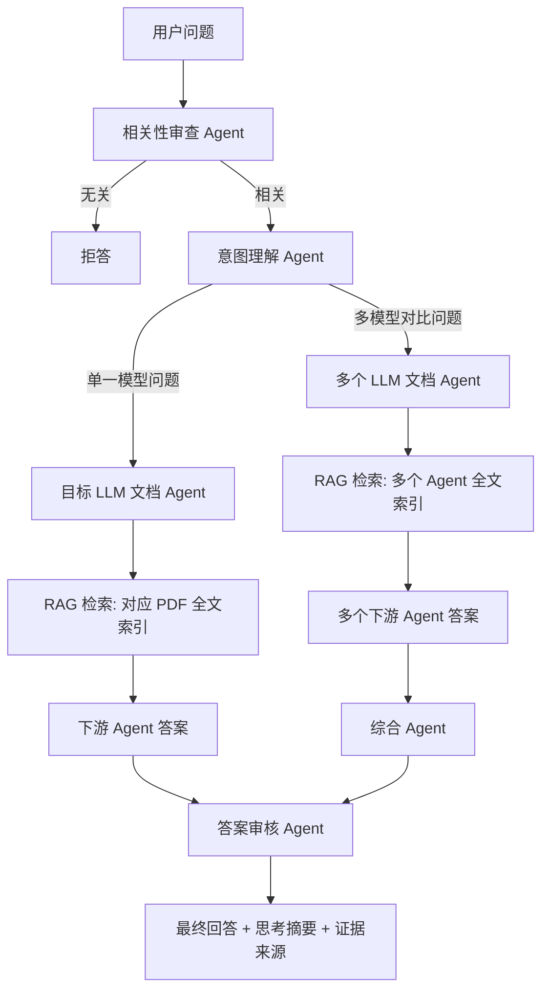

# Sparkle Ignis


## Sparkle AI Series

Sparkle Ignis 是 Sparkle AI 系列的第一代，也是这个系列的起点。

这个系列的长期设想不是只做一个普通问答工具，而是逐步构建一组具备明确分工、可组合、可审查、可扩展的 AI Agent。第一代 Ignis 的目标是先解决一个清晰场景：让系统能够阅读、理解和比较大模型技术报告，并把这些技术文档沉淀为可查询的专业知识网络。

第一代命名为 **Ignis**，含义上对应“火种”。它承担 Sparkle AI 系列的基础能力验证：

- 建立文档知识接入能力：把 PDF 技术报告转化为可检索、可引用的知识片段。
- 建立多 Agent 协作能力：让不同模型家族拥有各自的专业 Agent。
- 建立意图路由能力：判断用户问题应该由单个 Agent 回答，还是由多个 Agent 综合回答。
- 建立边界控制能力：问题与 LLM 技术文档无关时拒答。
- 建立答案审查能力：回答生成后进行二次审核，降低无依据输出。
- 建立产品形态：使用暖色调 Vue 前端和 Sparkle Ignis 图标，作为 Sparkle AI 系列的第一代界面基线。

后续 Sparkle AI 系列可以继续扩展到更多方向，例如论文研究 Agent、代码工程 Agent、产品分析 Agent、行业情报 Agent、多模态资料 Agent，以及更完整的个人知识操作系统。Ignis 先把“技术文档研究”这个核心能力做扎实。

### 第一代 AI 定位

| 项目 | 定位 |
| --- | --- |
| 系列名称 | Sparkle AI Series |
| 第一代名称 | Sparkle Ignis |
| 核心能力 | LLM 技术文档研究、多 Agent RAG、技术路线对比 |
| 主要输入 | `LLM/` 目录中的 PDF 技术报告 |
| 主要输出 | 有证据来源的中文技术回答、对比总结、演进分析 |
| 关键约束 | 只回答与 LLM 技术文档相关的问题 |
| 模型接口 | DeepSeek API，可退回本地 RAG 摘要模式 |
| 前端风格 | Vue、暖色调、简洁、面向研究任务 |

### Agent 架构

Sparkle Ignis 第一代采用多级 Agent 架构。底层是每个模型家族的文档 Agent，上层是负责审查、路由、综合和复核的控制 Agent。



当前内置的下游 Agent 来自 `LLM/` 目录结构：

```text
LLM/
  ChatGPT/   -> ChatGPT Agent
  Claude/    -> Claude Agent
  DeepSeek/  -> DeepSeek Agent
  Gemini/    -> Gemini Agent
  Gemma/     -> Gemma Agent
  GLM/       -> GLM Agent
  Kimi/      -> Kimi Agent
  LLaMA/     -> LLaMA Agent
  MiniMax/   -> MiniMax Agent
  Qwen/      -> Qwen Agent
  Seed/      -> Seed Agent
```

上层控制 Agent：

- **相关性审查 Agent**：判断问题是否属于 LLM 技术文档范围。
- **意图理解 Agent**：判断问题是单 Agent 问题还是多 Agent 综合问题。
- **综合 Agent**：整合多个下游 Agent 的结论，形成横向对比。
- **答案审核 Agent**：检查答案是否有证据支持、是否规范、是否需要修正。

Sparkle Ignis 是 Sparkle AI 系列的第一代原型系统，定位为面向大模型技术文档的多级 Agent 研究台。项目会扫描 `LLM/` 目录中的 PDF 技术报告，为每个模型家族或厂商自动创建文档 Agent，并通过 RAG、意图路由、相关性审查和答案审核完成问答。

当前版本聚焦以下目标：

- 将 `LLM/<模型或厂商>` 目录自动映射为独立下游 Agent。
- 支持单模型问题，例如 “KimiAI 框架的演进过程”。
- 支持多模型横向问题，例如 “Qwen 和 DeepSeek 的训练路线有什么差异”。
- 支持自动路由，也支持前端手动选择 Agent。
- 对完全无关问题进行拒答，避免系统脱离文档范围。
- 对最终答案进行二次审核，检查证据、规范性和回答质量。
- 使用 Vue 构建简洁暖色调前端，使用 Docker 封装部署。

项目图标来自：

```text
sparkle-ignis-logo.svg
```

## 功能架构

### 1. 文档 Agent 注册

系统会读取 `LLM/` 下的一级目录：

```text
LLM/
  Kimi/
  Qwen/
  DeepSeek/
  Claude/
  Gemini/
  ...
```

每个目录会注册为一个 Agent，例如：

- `Kimi Agent`
- `Qwen Agent`
- `DeepSeek Agent`
- `Claude Agent`

注册逻辑位于：

```text
sparkle_researcher/registry.py
```

### 2. RAG 检索

RAG 采用两级索引策略：

1. 元数据索引
   - 启动或首次提问时快速构建。
   - 只包含文档标题、目录归属、Agent 名称和别名。
   - 用于相关性判断和 Agent 路由。

2. Agent 全文索引
   - 当某个 Agent 首次被命中时，才解析该 Agent 对应 PDF。
   - 解析后会切分文本片段并缓存到 `.sparkle/index/agents/`。
   - 后续问题复用缓存，不再重复解析 PDF。

索引实现位于：

```text
sparkle_researcher/rag/index.py
sparkle_researcher/rag/pdf_loader.py
sparkle_researcher/rag/text_splitter.py
sparkle_researcher/rag/query.py
```

当前版本使用：

- `pypdf` 解析 PDF 文本
- `scikit-learn` TF-IDF
- word n-gram + char n-gram 混合检索

这个方案不依赖本地向量数据库，部署简单。后续可以替换为 bge/m3e embedding + FAISS、Milvus、Qdrant 或 pgvector。

### 3. 多级 Agent 编排

主编排器位于：

```text
sparkle_researcher/agents/orchestrator.py
```

请求流程：

1. 相关性审查 Agent
   - 判断问题是否属于 LLM 技术文档范围。
   - 如果问题完全无关，直接拒答。

2. 意图理解 Agent
   - 判断问题是单模型问题还是多模型综合问题。
   - 支持显式模型名识别，例如 Kimi、Qwen、DeepSeek、Claude。
   - 支持前端手动指定 Agent。

3. 下游知识 Agent
   - 对每个目标 Agent 执行 RAG 检索。
   - 基于检索证据生成答案。

4. 综合 Agent
   - 当问题需要多个 Agent 时，整合下游 Agent 的结论。

5. 答案审核 Agent
   - 二次检查答案是否有证据支持。
   - 检查回答是否过短、是否脱离问题、是否需要修正。

### 4. DeepSeek API

项目计划使用 DeepSeek API。配置后系统会调用 DeepSeek 生成更自然、更完整的答案。

如果没有配置 `DEEPSEEK_API_KEY`，系统会自动退回本地 RAG 摘要模式，保证项目仍可运行。

相关代码：

```text
sparkle_researcher/deepseek_client.py
```

## 前端

前端使用 Vue 3 + Vite，整体为暖色调，突出 Sparkle Ignis 第一代品牌。

主要能力：

- 左侧 Agent 选择
- 自动路由 / 多 Agent 综合 / 指定 Agent
- 索引状态展示
- 元数据索引重建
- 类 Claude 的对话式交互
- 展示思考摘要、答案和证据来源

前端源码：

```text
frontend/
  index.html
  package.json
  public/
    sparkle-ignis-logo.svg
  src/
    App.vue
    main.js
    styles.css
```

注意：页面展示的是“思考摘要”，用于说明检索、路由和审核过程，不暴露模型隐藏推理链。

## 目录结构

```text
.
├── Dockerfile
├── docker-compose.yml
├── main.py
├── requirements.txt
├── sparkle-ignis-logo.svg
├── README.md
├── frontend/
│   ├── index.html
│   ├── package.json
│   ├── public/
│   │   └── sparkle-ignis-logo.svg
│   └── src/
│       ├── App.vue
│       ├── main.js
│       └── styles.css
├── sparkle_researcher/
│   ├── api/
│   ├── agents/
│   ├── rag/
│   ├── cli.py
│   ├── config.py
│   ├── deepseek_client.py
│   ├── models.py
│   └── registry.py
└── LLM/
    ├── Kimi/
    ├── Qwen/
    ├── DeepSeek/
    └── ...
```

## 本地运行

### 1. 安装 Python 依赖

建议 Python 版本：

```text
Python 3.11+
```

当前开发环境验证过：

```text
Python 3.13.6
```

安装：

```powershell
python -m venv .venv
.\.venv\Scripts\python -m pip install -r requirements.txt
```

### 2. 安装前端依赖

```powershell
cd frontend
npm install
npm run build
cd ..
```

Windows PowerShell 如果拦截 `npm.ps1`，可以使用：

```powershell
npm.cmd install
npm.cmd run build
```

### 3. 配置 DeepSeek

PowerShell：

```powershell
$env:DEEPSEEK_API_KEY="你的 DeepSeek API Key"
$env:DEEPSEEK_MODEL="deepseek-chat"
```

可选：

```powershell
$env:DEEPSEEK_BASE_URL="https://api.deepseek.com"
$env:SPARKLE_RETRIEVAL_TOP_K="8"
```

如果不配置 API Key，系统会使用本地 RAG 摘要模式。

### 4. 启动服务

```powershell
python main.py --host 127.0.0.1 --port 8765
```

访问：

```text
http://127.0.0.1:8765
```

## Docker 运行

### 1. 构建镜像

```powershell
docker build -t sparkle-ignis:first-generation .
```

### 2. 运行容器

推荐将本地 `LLM/` 目录挂载进容器，避免把大量 PDF 固化进镜像。

PowerShell：

```powershell
docker run --rm -p 8765:8765 `
  -e DEEPSEEK_API_KEY="$env:DEEPSEEK_API_KEY" `
  -v "${PWD}\LLM:/app/LLM:ro" `
  -v sparkle_ignis_index:/app/.sparkle/index `
  sparkle-ignis:first-generation
```

访问：

```text
http://127.0.0.1:8765
```

### 3. 使用 Docker Compose

```powershell
docker compose up --build
```

Compose 会：

- 构建前端 Vue 项目
- 安装 Python 后端依赖
- 暴露 `8765` 端口
- 挂载本地 `LLM/` 到容器
- 使用 Docker volume 保存 RAG 索引缓存

## 命令行工具

列出 Agent：

```powershell
python -m sparkle_researcher.cli list-agents
```

查看索引状态：

```powershell
python -m sparkle_researcher.cli status
```

构建元数据索引：

```powershell
python -m sparkle_researcher.cli build-index
```

构建指定 Agent 全文索引：

```powershell
python -m sparkle_researcher.cli build-index --agent kimi
```

构建全部 Agent 全文索引：

```powershell
python -m sparkle_researcher.cli build-index --full
```

注意：`--full` 会解析全部 PDF，耗时较长。

命令行提问：

```powershell
python -m sparkle_researcher.cli chat "我想要知道 KimiAI 框架的演进过程" --agent kimi
```

## API

### 获取 Agent 列表

```http
GET /api/agents
```

返回：

```json
{
  "agents": [
    {
      "id": "kimi",
      "name": "Kimi",
      "pdf_count": 13,
      "documents": []
    }
  ]
}
```

### 获取索引状态

```http
GET /api/index/status
```

### 重建元数据索引

```http
POST /api/index/rebuild
```

### 聊天

```http
POST /api/chat
Content-Type: application/json
```

请求：

```json
{
  "question": "我想要知道 KimiAI 框架的演进过程",
  "agent_ids": ["kimi"]
}
```

自动路由：

```json
{
  "question": "DeepSeek 和 Qwen 的 MoE 路线有什么区别？",
  "agent_ids": []
}
```

返回字段：

- `status`：`ok`、`rejected` 或 `error`
- `answer`：最终回答
- `thinking`：可展示的检索、路由、审核摘要
- `intent`：意图识别结果
- `agents`：下游 Agent 结果
- `evidence`：引用证据
- `audit`：答案审核结果

## 环境变量

| 变量 | 默认值 | 说明 |
| --- | --- | --- |
| `DEEPSEEK_API_KEY` | 空 | DeepSeek API Key |
| `DEEPSEEK_BASE_URL` | `https://api.deepseek.com` | DeepSeek API 地址 |
| `DEEPSEEK_MODEL` | `deepseek-chat` | DeepSeek 模型名 |
| `SPARKLE_LLM_DIR` | `./LLM` | PDF 文档目录 |
| `SPARKLE_INDEX_DIR` | `./.sparkle/index` | RAG 索引缓存目录 |
| `SPARKLE_FRONTEND_DIR` | `./frontend` | 开发前端目录 |
| `SPARKLE_FRONTEND_DIST_DIR` | `./frontend/dist` | Vue 构建产物目录 |
| `SPARKLE_CHUNK_SIZE` | `1500` | 文本切片长度 |
| `SPARKLE_CHUNK_OVERLAP` | `180` | 文本切片重叠 |
| `SPARKLE_RETRIEVAL_TOP_K` | `8` | 检索返回片段数 |
| `SPARKLE_MULTI_AGENT_LIMIT` | `4` | 自动多 Agent 路由上限 |
| `SPARKLE_RELEVANCE_THRESHOLD` | `0.018` | 相关性拒答阈值 |

## 示例问题

单 Agent：

```text
我想要知道 KimiAI 框架的演进过程
```

多 Agent：

```text
Qwen、DeepSeek 和 Kimi 在训练基础设施上的技术路线有什么差异？
```

安全与对齐：

```text
Claude 的 Constitutional AI 路线与 OpenAI 的 alignment 方法有什么不同？
```

无关问题：

```text
今天上海天气怎么样？
```

系统会拒答，因为问题不属于当前 LLM 技术文档范围。

## 当前限制

- PDF 文本抽取依赖 `pypdf`，扫描版 PDF 或复杂排版可能抽取质量较差。
- 默认检索是 TF-IDF，不是语义 embedding；中文复杂问法可能需要继续增强 query expansion。
- 未配置 DeepSeek API 时，答案为本地摘要模式，表达质量不如 LLM 生成。
- 当前系统没有用户登录、权限控制和多租户隔离。
- Docker 镜像默认不包含 `LLM/` PDF，需要运行时挂载。

## 后续路线

建议后续迭代：

- 引入 embedding 模型和向量数据库。
- 增加 PDF 表格、图注、公式和章节结构解析。
- 增加引用定位跳转。
- 增加 Agent 配置面板。
- 增加对话历史持久化。
- 增加评测集，验证拒答、路由、引用准确率。
- 增加 CI，自动执行前端构建、Python 编译和 Docker build。

## License

当前仓库未指定开源许可证。如需公开复用，请先补充 License。
